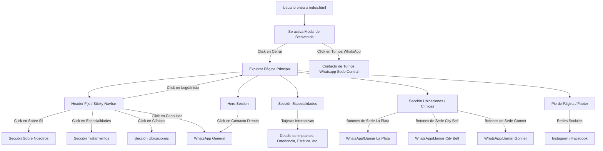

# 🗺️ Flujos Lógicos del Sistema (`flows_graph.md`)

Este gráfico describe la experiencia del usuario y cómo interactúan las distintas secciones y modales en Odontología Sil.

## 📈 Grafo de Navegación del Usuario

## 🛠️ Interacciones Especiales
1. **Modal de Bienvenida (`popup`)**:
   - Se muestra automáticamente a los 500ms de cargar la página si el usuario no tiene una cookie o propiedad en `localStorage` (`sil-welcome-shown`).
   - Muestra un texto resumido de los servicios integrales de Odontología Sil y un botón llamativo para reservar turnos en WhatsApp.
2. **Scroll Suave e Interactivo**:
   - Menú de navegación fijo en dispositivos desktop y colapsable (menú hamburguesa) en móvil.
   - Enlace activo resaltado visualmente con una transición suave al hacer scroll sobre la sección correspondiente.
